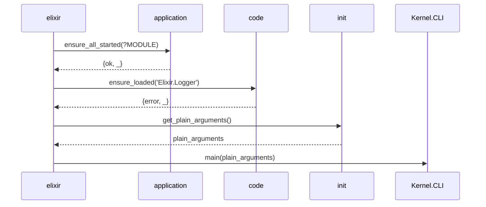
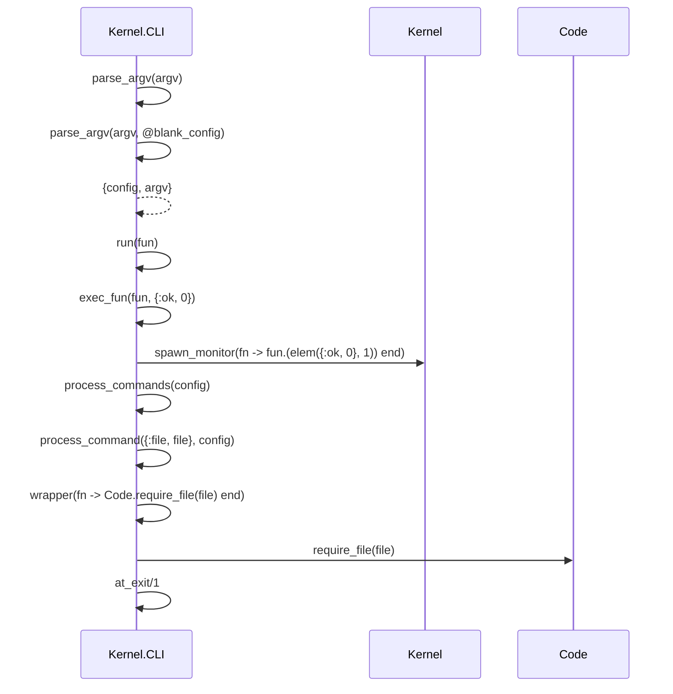
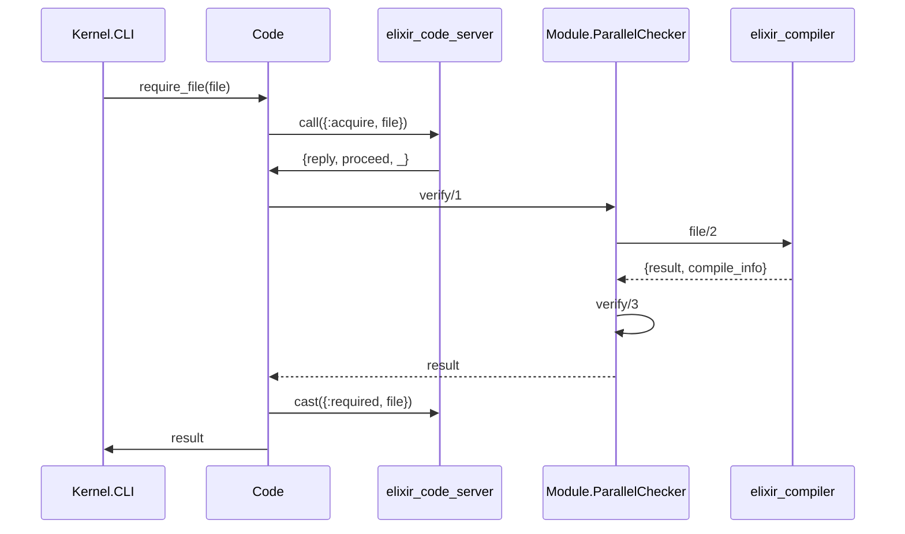
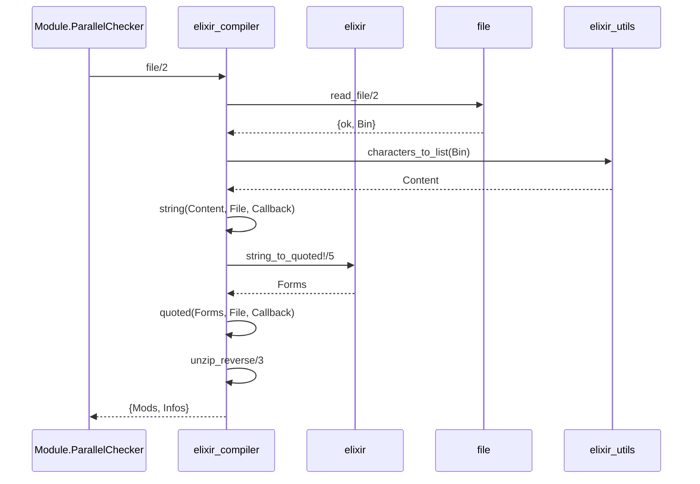
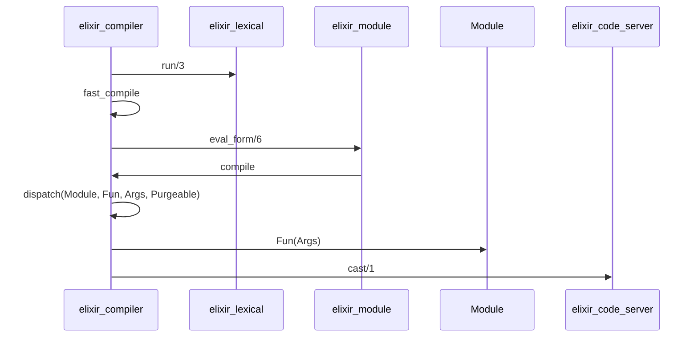

# Elixir 执行流程

## Code

```elixir
IO.puts "Hello, Elixir!"
```

## Command

```bash
erl -pa ebin -elixir ansi_enabled true -noshell -s elixir start_cli -extra example/hello.ex
```

## Sequence Diagram

### `elixir:start_cli/0`



### `Kernel.CLI:main/1`



`Kernel.CLI:main/1`

- `Kernel.CLI:parse_argv/1`
- `Kernel.CLI:process_command/2`

可知, `parse_argv` 解析 `argv`, 定义 `config`, 传给 `process_command`, 继而调用 `Code:require_file/1`.

通过 Debug, 得:

```elixir
argv = "example/hello.ex"
config = %{
  commands: [file: "example/hello.ex"],
  compile: [],
  compiler_options: [],
  errors: [],
  no_halt: false,
  output: ".",
  pa: [],
  profile: nil,
  pz: [],
  verbose_compile: false
}

```

### `Code:require_file/1`



### `elixir_compiler:file/2`



### `elixir_lexical:run/3`



细节待补充.

## ETS

## 进程字典

## API
