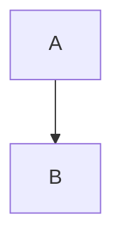

# Hello Elixir

## Code

```elixir
IO.puts "Hello, Elixir!"
```

## Command

```bash
erl -pa ebin -elixir ansi_enabled true -noshell -s elixir start_cli -extra example/hello.ex
```

## Elixir


```mermaid
graph TD;
    A-->B;
```
