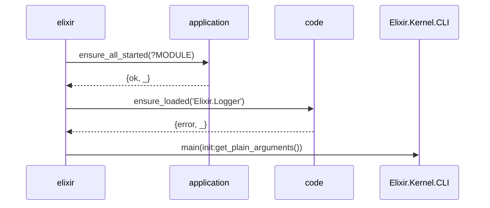
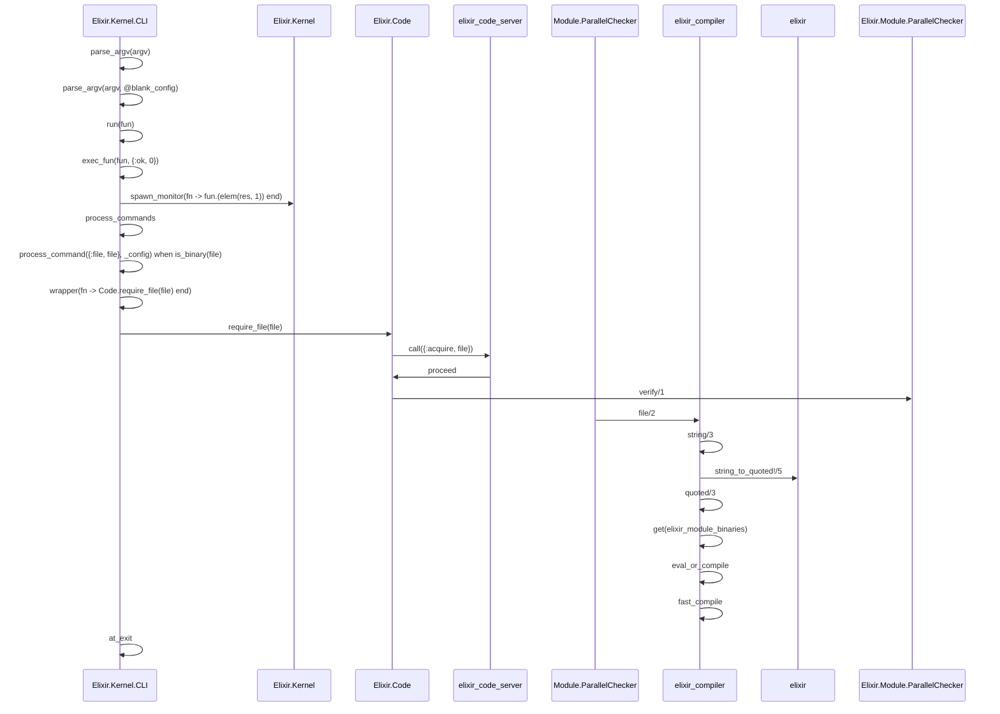

# Hello Elixir

## Code

```elixir
IO.puts "Hello, Elixir!"
```

## Command

```bash
erl -pa ebin -elixir ansi_enabled true -noshell -s elixir start_cli -extra example/hello.ex
```

## Sequence Diagram

### `elixir:start_cli`



### `Elixir.Kernel.CLI:main`



可知, `main` 函数主要由 `parse_argv` 和 `process_command` 两个重要过程构成.

`parse_argv` 解析 `argv`, 定义 `config`, 传给 `process_command`.

编译过程有点复杂, 需要单独拿出来.

## Debug

```bash
make clean_elixir compile

bin/elixir example/hello.ex
```

### Info

```elixir
argv = "example/hello.ex"
config = %{
  commands: [file: "example/hello.ex"],
  compile: [],
  compiler_options: [],
  errors: [],
  no_halt: false,
  output: ".",
  pa: [],
  profile: nil,
  pz: [],
  verbose_compile: false
}

```

## API

```erlang
application:ensure_all_started/1
code:ensure_loaded/1
init:get_plain_arguments/0
maps:to_list/1
```
